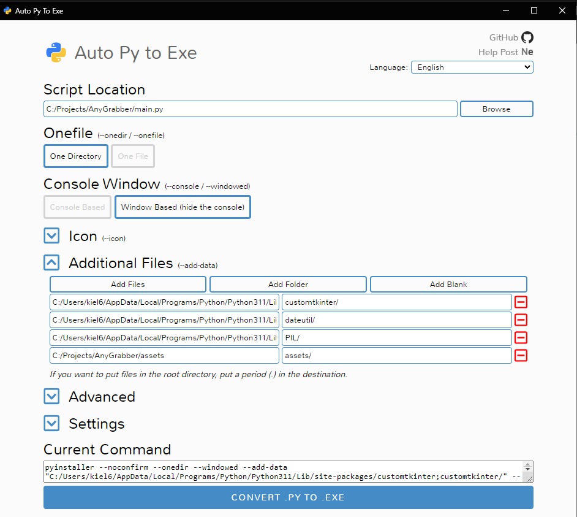
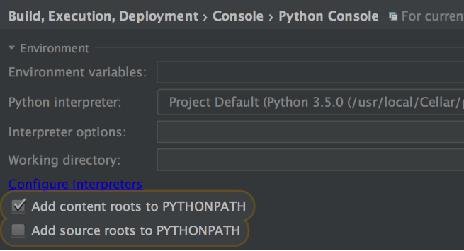

## Building

Easiest way to build portable version of app is to use [auto-py-to-exe](https://pypi.org/project/auto-py-to-exe/) and
add folders containing customtkinter,
dateutil
and PIL. You also need to add assets folder that includes images used in app.



If you prefer to use pyinstaller command you need to swap locations of file to match your system.

**IMPORTANT**- If you are using PyCharm be sure to install dependencies globally via PIP, because local venv versions
cause bugs and don't work properly

```python
pyinstaller --noconfirm --onedir --windowed --add-data
"C:/Users/kiel6/AppData/Local/Programs/Python/Python311/Lib/site-packages/customtkinter;customtkinter/" - -add - data
"C:/Users/kiel6/AppData/Local/Programs/Python/Python311/Lib/site-packages/dateutil;dateutil/" - -add - data
"C:/Users/kiel6/AppData/Local/Programs/Python/Python311/Lib/site-packages/PIL;PIL/" - -add - data
"C:/Projects/AnyGrabber/assets;assets/"  "C:/Projects/AnyGrabber/main.py"
```

**--- OR ---**

Un check those
options [Big thanks to this stackoverflow post](https://stackoverflow.com/questions/36618749/module-imports-work-in-pycharm-dont-work-in-python-idle/36618847#36618847):




