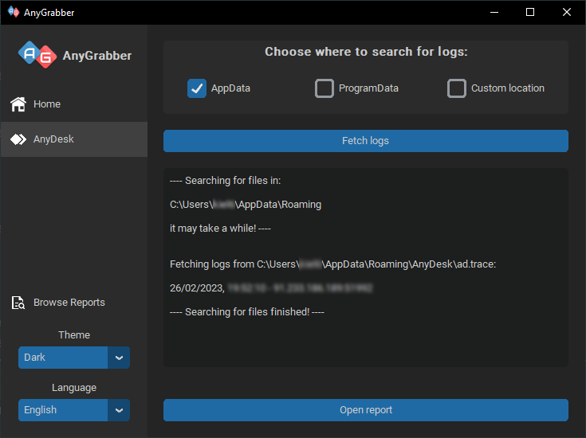

#   AnyGrabber

AnyGrabber enables rapid searching for AnyDesk logs, extracting relevant data concerning IP addresses used for logging
in, along with corresponding dates. This application further provides the capacity to generate comprehensive .txt and
.csv reports based on the data retrieved. The application's straightforward graphical user interface and localization
features facilitate ease of use for non-technical users.



## Key Features:

- Search for logs in default and custom locations
- Extraction of login date and IP address/es for specific computer
- Generation of checksums for retrieved files
- Creation of .txt and .csv reports based on found data
- Support for English and Polish languages
- User-friendly interface

## Motivation

Extracting data from AnyDesk logs can be a laborious and time-consuming process, particularly for non-technical users
who may not have prior knowledge of log locations. The process typically involves extensive searching through irrelevant
information to locate relevant data, including dates and IP addresses. Many first responders may abandon the task
entirely due to the complexity involved or may spend significant amounts of time sifting through the data.

AnyGrabber aims to simplify this issue by providing a user-friendly solution for searching and retrieving AnyDesk logs.
The application caters to both novice and advanced users by offering a simplified, intuitive interface that simplifies
the log retrieval process, while also offering more advanced capabilities for users with greater technical expertise.

By offering a streamlined solution for AnyDesk log retrieval, AnyGrabber eliminates the frustration and complexity of
this process, enabling users to quickly and easily locate the data they require. Overall, AnyGrabber is a powerful tool
for both novice and advanced users seeking an efficient and user-friendly solution for extracting data from AnyDesk
logs.

## Building

Easiest way to build portable version of app is to use [auto-py-to-exe](https://pypi.org/project/auto-py-to-exe/) and
add folders containing customtkinter,
dateutil
and PIL. You also need to add assets folder that includes images used in app.


If you prefer to use pyinstaller command you need to swap locations of file to match your system.

**IMPORTANT**- If you are using PyCharm be sure to install dependencies globally via PIP, because local venv versions
cause bugs and don't work properly

```python
pyinstaller - -noconfirm - -onedir - -windowed - -add - data
"C:/Users/kiel6/AppData/Local/Programs/Python/Python311/Lib/site-packages/customtkinter;customtkinter/" - -add - data
"C:/Users/kiel6/AppData/Local/Programs/Python/Python311/Lib/site-packages/dateutil;dateutil/" - -add - data
"C:/Users/kiel6/AppData/Local/Programs/Python/Python311/Lib/site-packages/PIL;PIL/" - -add - data
"C:/Projects/AnyGrabber/assets;assets/"  "C:/Projects/AnyGrabber/main.py"
```

**--- OR ---**

Un check those
options [Big thanks to this stackoverflow post](https://stackoverflow.com/questions/36618749/module-imports-work-in-pycharm-dont-work-in-python-idle/36618847#36618847):


